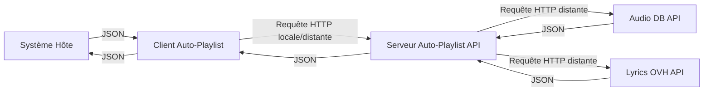

# Auto-Playlist API

Usage : python main.py -h | -f \<json-file\> -g \<number-of-songs\> -s \<server-hostname\> -p \<server-port\> [--random]

## Présentation

Cette API propose des fonctionnalités permettant de faciliter la génération 
de playlists musicales à partir des goûts de l'utilisateur.

Elle repose sur les données d'AudioDB et de LyricsOvh pour proposer des
playlists de vidéos musicales YouTube.

## Installation

Si le système hôte dispose d'une installation fonctionnelle de Python 3.7+ (compatibilité garantie avec Python 3.10) 
et de pip, l'installation peut s'effectuer directement à partir de ce dépôt Git :
```shell
git clone https://gitlab.com/maxence-lagalle/auto-playlist-api.git
cd auto-playlist-api
pip install -r requirements.txt
```

## Utilisation

### Mode serveur

Pour lancer l'API en mode serveur, il suffit de lancer le script main.py, sans paramètres supplémentaires :
```shell
python main.py
```

Par défaut, l'API est lancée en local et est accessible sur le port 8000.
Pour modifier le nom d'hôte et/ou le port sur lequel l'API est accessible, des paramètres de ligne de commande supplémentaires
sont disponibles :
```shell
python main.py -s example.hostname.tld -p 10000
```

#### Points d'accès disponibles

Tous les points d'accès sont disponibles en HTTP via une requête GET.
* / : réalise un "healthcheck" sur l'API et ses sources de données
* /random/{artist name} : retourne une chanson aléatoire de {artist name} avec le titre, la vidéo YouTube et les paroles

### Mode client

Pour utiliser le client intégré, vous devez tout d'abord disposer d'une liste d'artistes au format JSON. Ce fichier 
peut être structuré comme suit :
```json
[{
    "artiste": "Queen",
    "note": 18
},{
    "artiste": "Dire Straits",
    "note": 16
}]
```

Pour utiliser le système intelligent de génération de playlist (par défaut), les champs "artiste" et "note" sont nécessaires.
La note sert à pondérer l'importance des artistes dans la playlist. Pour le système aléatoire, seul le champ "artiste" est obligatoire.

Pour utiliser le client avec l'API exécutée localement et générer une playlist, il suffit de préciser le nom du fichier
à utiliser en ligne de commande :
```shell
python main.py -f liste_artistes.json
```

Cette commande lancera dans un thread séparé l'API localement, puis utilisera le client pour générer la playlist qui
sera sauvegardée dans un fichier playlist_<nom_fichier>.json. Il est possible de modifier le port local d'exécution de 
l'API avec l'option -p.

Le système intelligent est plus long à fonctionner car il vérifie d'abord la disponibilité des paroles des chansons de
chaque artiste demandé avant de composer la playlist. Pour aller plus vite, au risque d'avoir des doublons, il est possible
d'utiliser un système aléatoire avec l'option --random :
```shell
python main.py -f liste_artistes.json --random
```

Il est également possible d'utiliser ce client avec une version distante de l'API en précisant son nom d'hôte avec
l'option -s.

Enfin, le client est configuré pour générer par défaut une playlist de 20 chansons. Ce nombre peut être modifié avec le
paramètre -g.

Exemple de commande utilisant l'API hébergée sur playlist.example.com:7548 pour générer une
playlist de 30 chansons à partir du fichier mes_artistes.json :
```shell
python main.py -f mes_artistes.json -g 30 -s playlist.example.com -p 7548
```

Un aide-mémoire sur les paramètres disponibles est accessible à partir de l'option -h.

## Développement

### Schéma d'architecture



### Tests unitaires

Ce projet utilise PyTest pour ses tests unitaires. Les API fournisseuses de données sont mockées pour
réduire l'impact réseau des tests. Pour lancer l'ensemble des tests disponibles sur le projet, il suffit d'utiliser la
commande suivante :
```shell
pytest
```

Ces tests sont également exécutés à chaque mise à jour du code en intégration continue GitLab.